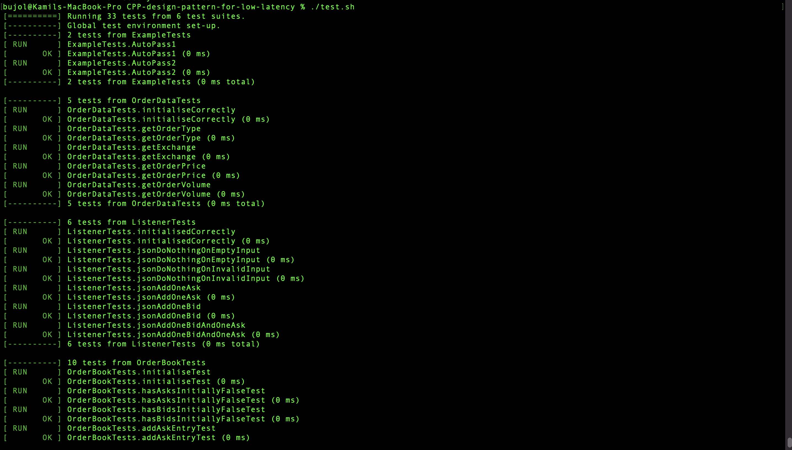
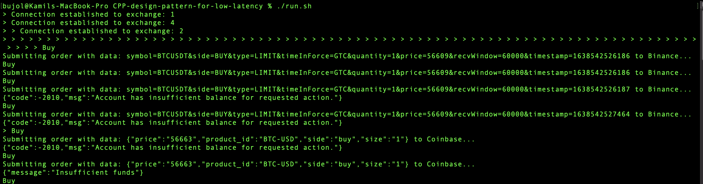
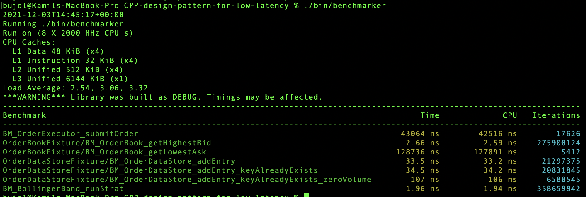
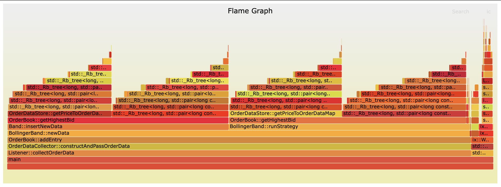

# Low Latency Trading System Benchmarking Suite


## Requirements
**OS X**:

1. Install cmake: `brew install cmake` (3.20+)
1. Install gcc10+: `brew install gcc@10`
1. Install libcurl.
1. Check gcc is correctly installed: `g++-10 --version`
1. Install clang-format: `brew install clang-format`

**Ubuntu**:
1. Install g++-10 & gcc-10.
1. Install cmake3.20+ from source
1. `sudo apt-get install libcurl-dev clang-format libssl-dev`
1. Install perf and other dev tools: ```apt-get install linux-tools-common 
   linux-tools-generic linux-tools-\`uname -r\` ```

## Setup
1. Check out submodules: `git submodule update --init --recursive`

## Build
Good introduction to CMake: https://cliutils.gitlab.io/modern-cmake/

Simply run: `build.sh`

Alternatively:

1. Generate build Makefiles: `cmake -S . -B build`
1. Run `cmake --build build`
1. Install the files with: `cmake --install build`

## Testing


We use Google Test for our testing, checked out as one of the submodules.

1. Build
2. Run `./test.sh`

More details are in [the testing readme](test/README.md)

## Running


1. Build
2. Run `./run.sh`, or altenatively run `./bin/main`.


# Benchmarking

There are 2 benchmarking tools integrated into this project, both with 
widely different features. 

## Google Benchmark


Google Benchmark is a microbenchmarking tool that allows us to measure the 
performance of each individual function in C++ - thus providing us with a 
way to reliable benchmark improvements in our code and the whole hotpath.


TODO + let's make sure we have a single script we can run here (similar to 
build.sh, run.sh and benchmark-perf.sh)

## perf


`perf` is a profiler that is able to monitor the performance of our code in 
real-time. It works by interrupting the program with frequency `f` and sampling 
the current stack frame. Based on that, it is able to analyse which 
functions consume the most of the execution path. It is a useful tool to 
initially pintpoint which parts of our programme are the slowest.

As a summary of your performance, we generate an HTML interactive FlameGraph that allows you to explore your call stacks.

To investigate more, we recommend you to run `perf report` and investigate call stacks and annotations (code).

To run perf, please follow the following steps:

1. Follow the steps for Build
1. Run `(sudo) ./benchmark-perf.sh {html_output_filename}`
1. Press CTRL-C after 1-2 minutes of the profiler running.
1. Explore output in your favourite favourite browser.

Please bear in mind that perf work on *Linux-only.*

## Implementing your own code for benchmarking

### Adding a new trading strategy/algo

1. Create a new algo to implement methods in `TradingStrategy.h`
2. Add new files to source files within `tradingStrategies/CMakeLists.txt`
3. OPTIONAL: To change how and when to run the strategy itself, alter `updateData` method within `TradingStrategy.cpp`


### Adding a new exchange/changing data input feed  

#### Getting data from exchanges 
1. Create a new listener for the exchange to implement `Listener.h` methods, namely `passJSON(nlohmann::json json)`
2. OPTIONAL: To change how order data is constructed and sent edit the methods in `Listener.cpp` as desired

#### Getting data from a custom location
1. Implement methods from `OrderDataCollector.h` in a custom listener. Look at the `fileReaderListener` for an example
of how to do this.
2. Update CMake files as required

### Executing orders

#### Sending orders to an exchange 

1. Create a new order executor to implement `ExchangeOrderExecutor.h` methods in the ordering-system/exchangeExecutors folder
2. Update `Exchange.h` to contain the exchange name as an enum
3. Add new files to source files within `ordering-system/CMakeLists.txt`

#### Sending orders to a custom location

1. Create a new type of executor class to implement `OrderExecutor.h` similarly to `ExchangeOrderExecutor.h`
2. Update CMake files as appropriate

### Changing the map type within the order data system 
TODO I guess?

TODO: adding a new Google Benchmark

## Set up CLion
For some strange mysterious reason, CLion uses their own version of CMake
rather than the one installed in the system. Their version doesn't fully
support C++17 and causes issues in compiling some of our code.

To change it, it's worth to edit some settings:

1. In `Build, Execution, Deployment`, please make sure to edit CMake, GCC \&
   G++ to point to your own versions (location of which you can get with
   running `which <command>`).
1. In CMake settings, please select `Build Directory` as `build/`.

## Naming convention

branch name: \<issue-key\>-\<branch-name\>

e.g. `git checkout -b JRA-123-firstbranch`

commit message: "\<issue-key\> \<commit message\>"

e.g. `git  commit -m "JRA-123 first message"`

## Further Development Directions
1. Run tests as part of CI
1. Run benchmarks as part of CI
1. Push orders to exchanges using websockets
1. Improve the performance of the OrderBook class
1. Experiment with more advanced strategies